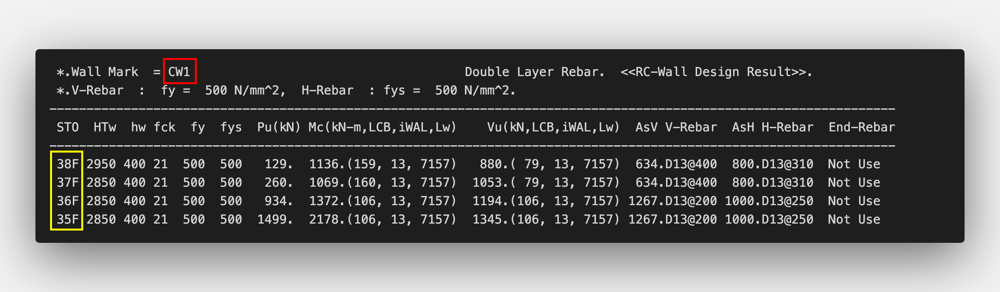
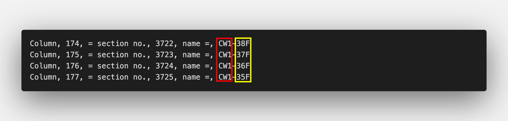
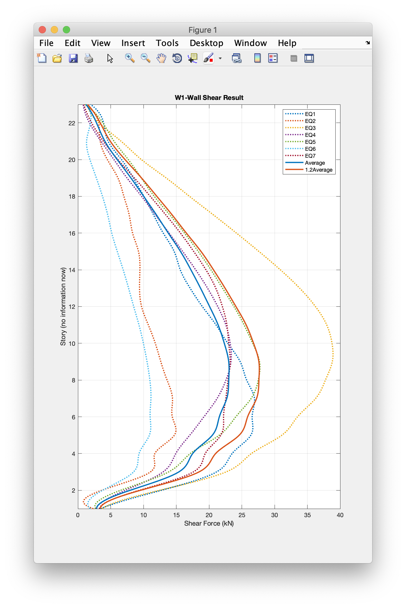
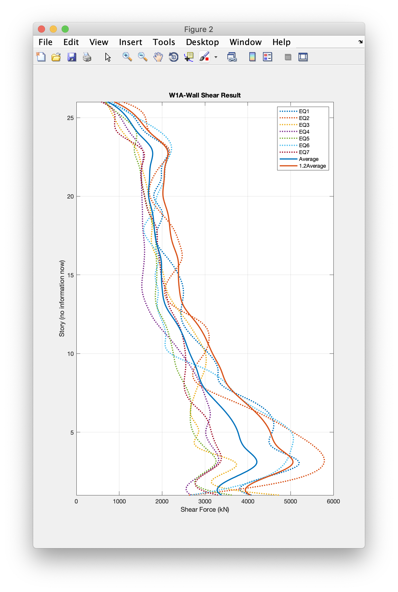

# Perform / Midas Gen 결과 정리

## Work Flow & Roadmap

- [x] Midas gen result text files parsing to object
- [x] Perform result text files parsing to object
- [x] Manipulation data relation and print result to object
- [ ] Plotting result with every member

## Example data structure

```bash
data
├── midasgen
│   └── gen_summery2.txt
└── perform
    ├── Wall_EQ1_V.txt
    ├── Wall_EQ1_V_2.txt
    ├── Wall_EQ2_V.txt
    ├── Wall_EQ2_V_2.txt
    ├── Wall_EQ3_V.txt
    ├── Wall_EQ3_V_2.txt
    ├── Wall_EQ4_V.txt
    ├── Wall_EQ4_V_2.txt
    ├── Wall_EQ5_V.txt
    ├── Wall_EQ5_V_2.txt
    ├── Wall_EQ6_V.txt
    ├── Wall_EQ6_V_2.txt
    ├── Wall_EQ7_V.txt
    └── Wall_EQ7_V_2.txt
```

## Result data files structure

```bash
result
├── midasgen
│   ├── demandShear
│   │   └── gen_summary2.json
│   └── gen_summary2.json
└── perform
    ├── Wall_EQ1_V.json
    ├── Wall_EQ1_V_2.json
    ├── Wall_EQ2_V.json
    ├── Wall_EQ2_V_2.json
    ├── Wall_EQ3_V.json
    ├── Wall_EQ3_V_2.json
    ├── Wall_EQ4_V.json
    ├── Wall_EQ4_V_2.json
    ├── Wall_EQ5_V.json
    ├── Wall_EQ5_V_2.json
    ├── Wall_EQ6_V.json
    ├── Wall_EQ6_V_2.json
    ├── Wall_EQ7_V.json
    ├── Wall_EQ7_V_2.json
    └── demandShear
        ├── Wall_EQ1_V.json
        ├── Wall_EQ1_V2.json
        ├── Wall_EQ2_V.json
        ├── Wall_EQ2_V2.json
        ├── Wall_EQ3_V.json
        ├── Wall_EQ3_V2.json
        ├── Wall_EQ4_V.json
        ├── Wall_EQ4_V2.json
        ├── Wall_EQ5_V.json
        ├── Wall_EQ5_V2.json
        ├── Wall_EQ6_V.json
        ├── Wall_EQ6_V2.json
        ├── Wall_EQ7_V.json
        └── Wall_EQ7_V2.json
```

### Midas Gen Demand Shear result JSON data structure

```json
[
  {
    "member": {
      "{memberName}": {
        "basicData": {
          "부재": [StringArray],
          "사용철근(수평)": [NumberArray],
          "간격입력": [NumberArray],
          "높이입력(m)": [NumberArray],
          "벽폭": [NumberArray],
          "V-항복강도": [NumberArray],
          "H-항복강도": [NumberArray],
          "강도A": [NumberArray],
          "벽길이(m)": [NumberArray],
          "강도B": [NumberArray],
          "벽길이(mm)": [NumberArray],
          "높이입력(mm)": [NumberArray]
        },
        "demandShear": {
          "수평철근 단면적": [NumberArray],
          "수평철근 간격": [NumberArray],
          "철근 항복기대강도": [NumberArray],
          "벽체 높이": [NumberArray],
          "벽체 연직단면적": [NumberArray],
          "철근 전체단면적": [NumberArray],
          "전단철근비": [NumberArray],
          "Vs": [NumberArray],
          "재료 강도": [NumberArray],
          "벽체 폭": [NumberArray],
          "벽체 길이": [NumberArray],
          "Vc": [NumberArray],
          "벽체 전단강도": [NumberArray],
          "max Vn": [NumberArray]
        }
      }
    }
  },
  ...
]
```

- 각 항목은 너무 많아서 생략

### Perform 3D Demand Shear result JSON data structure

```json
{
  "{memberName}": {
    "story": [StringArray],
    "maximum": [NumberArray],
    "minimum": [NumberArray],
    "shear": [NumberArray],
    "maxShear": Number
  },
  ...
}
```

- `{memberName}`: 부재 이름 (`['W1', 'W1A', 'W1AA', 'W1B', 'W1BB', 'W1D', 'W1DD',...]`)
- `story`: 층 ( `['38F','37F',...,'B1']`)
- `maximum`: 최대값 배열 (`[]`)
- `minimum`: 최소값 배열 (`[]`)
- `shear`: 각 층별 최대값, 최소값의 절대값 최대값
- `maxShear`: 최대전단력 값

## Notice

- Every file should match the member name as below,

- Midas Gen result



- Perform 3D result



## MATLAB Plot

### To do items

- [ ] Waiting Perform 3D result
- [x] Plotting result
- [ ] Automation all save result figures `PNG` or `EPS`

- `MATLAB/dataplotX.m`: `*_V.json`의 결과 플롯
- `MATLAB/dataplotY.m`: `*_V2.json`의 결과 플롯

| W1-Wall Shear Result | W1-A-Wall Shear Result |
|:---------:|:---------:|
|||